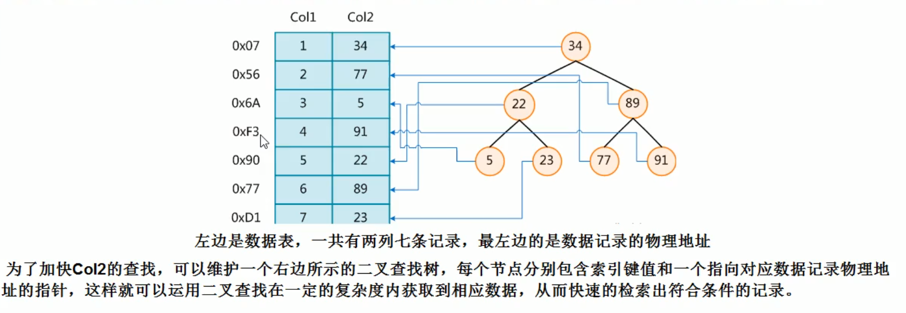
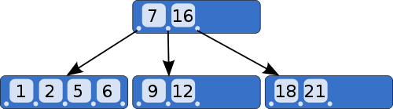
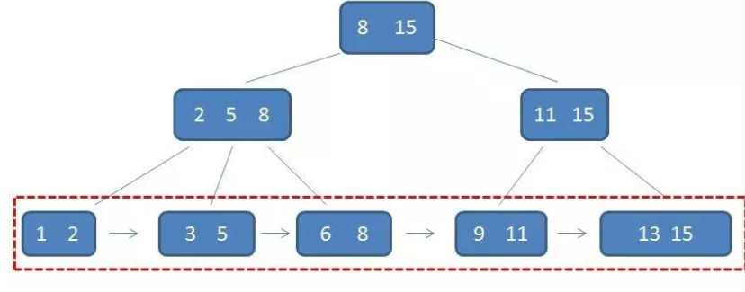

# MySQL高级知识-第3章


[toc]


## 索引

### 索引是什么

1. 索引是数据结构

Index-**索引是帮助MySQL高效获取数据的`数据结构`**，可以理解为是**排序好的快速查找数据结构** 
- 这句话怎么理解呢？

在数据之外，数据库系统还维护着满足特定查找算法的数据结构，这些数据结构以某种方式引用（指向）数据，这种数据结构就是索引。





2. 索引的目的

索引的目标在于查询效率，可以类比字典

如果要查mysql这个单词，肯定需要首先定位m, 然后从上到下找到y字母，再找到剩下的s->q->l

如果没有索引，那么可能需要a-----z.....

**`一般来说索引本身也很大，不可能全部存储在内存中，因此索引往往以索引文件的形式存储在磁盘上`**


3. 索引结构

索引一般都是指B树

复合索引，前缀索引，唯一索引默认都是使用B+树


**这两者有什么区别呢？**


### B树与B+树

#### B树

1. 二叉树

要理解B树，必须从二叉查找树（Binary search tree）讲起


二叉查找树是一种查找效率非常高的数据结构，它有三个特点。

>（1）每个节点最多只有两个子树。
>（2）左子树都为小于父节点的值，右子树都为大于父节点的值。
>（3）在n个节点中找到目标值，一般只需要log(n)次比较。

二叉查找树的结构不适合数据库，因为它的查找效率与层数相关。

越处在下层的数据，就需要越多次比较。

极端情况下，n个数据需要n次比较才能找到目标值。

对于数据库来说，每进入一层，就要从硬盘读取一次数据，这非常致命，因为硬盘的读取时间远远大于数据处理时间，数据库读取硬盘的次数越少越好。

<br>
2. B树

B树是对二叉查找树的改进。

它的设计思想是，将相关数据尽量集中在一起，以便一次读取多个数据，减少硬盘操作次数。





B树的特点也有三个。
>（1）一个节点可以容纳多个值。比如上图中，最多的一个节点容纳了4个值。
>（2）除非数据已经填满，否则不会增加新的层。也就是说，B树追求"层"越少越好。
>（3）子节点中的值，与父节点中的值，有严格的大小对应关系。一般来说，如果父节点有a个值，那么就有a+1个子节点。比如上图中，父节点有两个值（7和16），就对应三个子节点，第一个子节点都是小于7的值，最后一个子节点都是大于16的值，中间的子节点就是7和16之间的值。

这种数据结构，非常有利于减少读取硬盘的次数。

假定一个节点可以容纳100个值，那么3层的B树可以容纳100万个数据，如果换成二叉查找树，则需要20层！假定操作系统一次读取一个节点，并且根节点保留在内存中，那么B树在100万个数据中查找目标值，只需要读取两次硬盘。


#### 题外话 磁盘IO问题


问题:

>数据库索引是存在磁盘上的，当数据量比较大的时候，索引大小也会很大
>这时候我们利用索引查询的时候，能把整个索引全部加载到内存中？


**答案是显然不能，能做的只有逐一加载每个磁盘页，这样的磁盘页对应索引树的节点**


磁盘IO的次数 等于二叉树的高度

所以为了减少磁盘IO的次数， B树(B-树)就出现了


#### B树插入删除原理

-待补充


#### B+树

B+树是基于B-树的一种变体，有着比B-树更高的查询性能

首先，每个父节点的元素都出现在子节点中，是子节点的最大（或最小）元素

至于子节点，由于父节点的元素都出现在子节点中，因此所有子节点包含全量元素信息

并且每个叶子节点都指向下一个节点的指针，形成了一个有序链表


如图所示：




总结：

B+树相比于B-树的优势有三个

>1. 单一节点存储更多的元素，使得查询的IO次数更少
>2. 所有查询都要查找到叶子节点，查询性能稳定
>3. 所有叶子节点形成有序链表，便于范围查询


#### B+树插入删除原理

-待补充


### 优势

类似图书馆建书目索引，提高数据检索的效率，**降低数据库的IO成本**

通过索引对数据进行排序，降低数据排序的成本，**降低了CPU的损耗**


### 劣势

实际上索引也是一张表，该表保存了主键与索引字段，并指向实体表的记录，所以**索引列也是需要占用空间的**

虽然索引大大提高了查询速度，同时却会降低更新表的速度，如对表进行insert, update和delete.因为更新表，mysql不仅要保存数据，还要保存下一个索引文件每次更新添加了索引列的字段，都会调整因为更新所带来的键值变化后的索引信息

索引只是提高效率的一个因素，如果你的MySQL有大数据量的表，需要花时间建立最优秀的索引或者优化查询


### 索引分类

#### 单值索引

一个索引只包含单个列，一个表可以有多个单列索引


#### 唯一索引

索引列的值必须唯一，但允许有空值


#### 复合索引

一个索引包含多个列


#### 基本语法

1.创建

```
create [unique] index indexname on mytable(columnname(length))
alter mytable add [unique] index [indexname] on (columnname(length))
```

2.删除
```
drop index [indexname] on mytable
```


3.查看
```
show index from table_name\G
```

4.使用alter命令

```
ALTER TABLE TABLE_NAME ADD PRIMARY KEY(COLUMN_LIST) # 添加主键

ALTER TABLE TABLE_NAME ADD UNIQUE index_name(column_list) # 创建索引的值必须是唯一的

ALTER TABLE TABLE_NAME ADD INDEX index_name(column_list) # 添加普通索引

ALTER TABLE table_name ADD FULLTEXT index_name(column_list) # 全文索引

```


 
### 索引结构

#### BTree索引

检索原理 -待补充


#### Hash索引
-待补充

#### FullText索引
-待补充

#### R-Tree索引
-待补充


### 索引必要性

1. 哪些情况需要创建索引？

* 主键自动创建唯一索引
*  频繁作为查询条件的字段应该创建索引
*  查询中与其他表关联的字段，外键关系建立索引
*  频繁更新的字段不适合创建索引
*  Where条件里用不到的字段不创建索引
*  单键/组合索引的选择问题？
*  查询中排序的字段，排序字段若通过索引去访问将大大提高排序速度
*  查询中统计或者分组字段

2.哪些情况不需要创建索引？

* 表记录太少
* 经常增删改的表
* 数据重复且分布平均的表字段，因此应该只为最经常查询和最经常排序的数据列建立索引。如果某个数据列包含许多重复的内容，为它创建索引没有太大的实际效果

### 索引工作原理
-待补充

### 性能分析

-待补充


### 索引优化

* 全值匹配
* 最佳左前缀法则 -查询从索引的最左前列开始并且不跳过索引中的列
* 不在索引列上做任何操作，包含计算，函数，自动或者手动类型转化
* 存储引擎不能使用索引中范围条件右边的列
* 尽量使用覆盖索引（只访问索引的查询），减少select * 
* mysql在使用不等于的时候无法使用索引会导致全表扫描
* is null, is not null 也无法使用索引
* like 以通配符开头(%abc)，mysql索引失效会变成全表扫描的操作
* 字符串不加单引号索引失效
* 少用or,用它来连接时索引会失效


**-`需要每一条要有实例进行操作才能掌握`**
