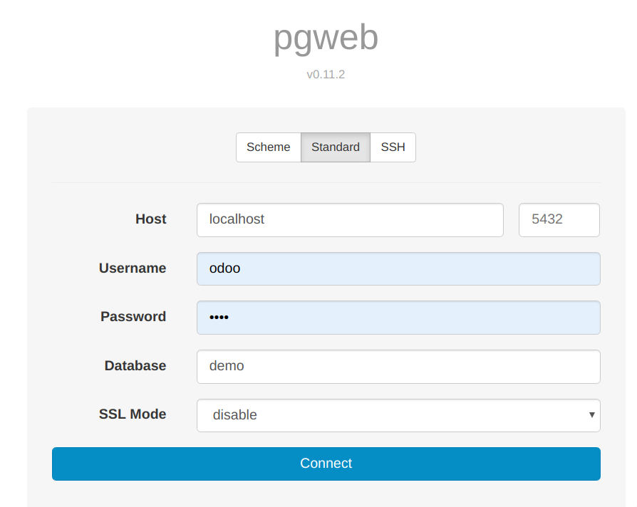
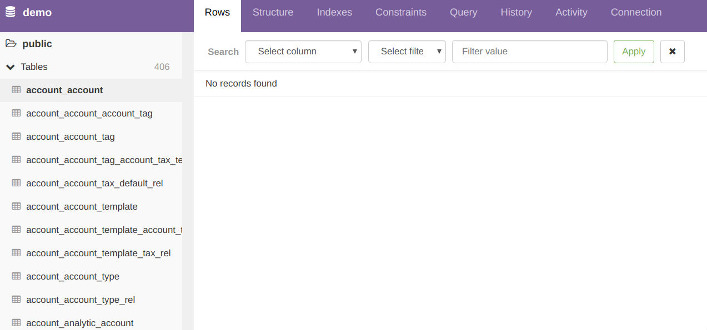

# PostgreSQL基础
<!-- TOC -->

- [PostgreSQL基础](#postgresql%e5%9f%ba%e7%a1%80)
  - [PG VS MySQL](#pg-vs-mysql)
  - [可视化工具](#%e5%8f%af%e8%a7%86%e5%8c%96%e5%b7%a5%e5%85%b7)

<!-- /TOC -->


## PG VS MySQL

1.Postgres优势
```
1.不仅仅是关系型数据库
除了存储正常的数据类型外，还支持array, json 和jsonb(二进制格式)
2.支持地图信息处理扩展(LBS业务) - PostGIS 
3.可以快速构建REST API - PostgREST
4.支持树状结构
5.强悍的SQL编程能力， 没有存储过程
6.外部数据源支持
7.没有字符串长度限制
8.支持图结构数据存储
9.支持窗口函数
10.对索引的支持更强，支持函数和条件索引
....
```

2.MySQL优势
```
1. MySQL比PG更流行
2. 回滚实现更优
3. windows上运行更可靠
4. 线程模式(MySQL), PQ(进程模式)
5. 权限设置更完善
6. ...
```

## 可视化工具

这里使用开源工具 [pgweb地址](https://github.com/sosedoff/pgweb)

开启方法：
```
[jian@laptop bin]$ ./pgweb_linux --user odoo --pass=odoo
```

然后在浏览器上访问[地址](http://localhost:8081/#)




