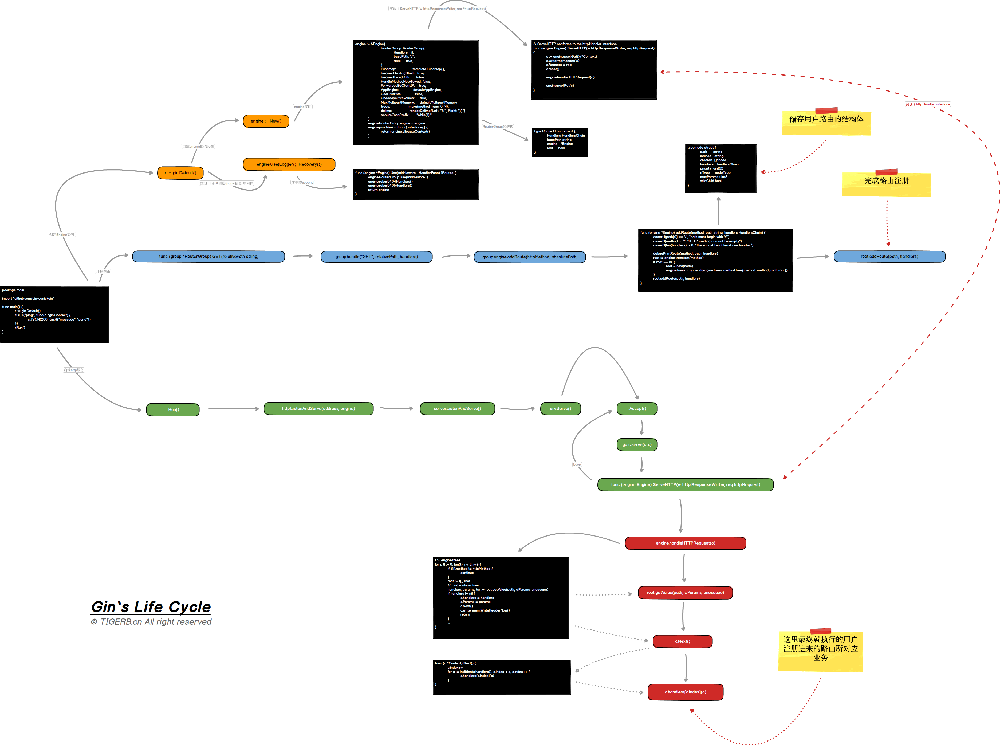

# 框架结构


<!-- TOC -->

- [框架结构](#框架结构)
    - [开始](#开始)
    - [框架分析](#框架分析)
        - [HTTP 服务器](#http-服务器)
            - [默认服务器](#默认服务器)
            - [HTTP服务器](#http服务器)
            - [HTTP服务器替换方案](#http服务器替换方案)
        - [生命周期](#生命周期)
        - [Context](#context)

<!-- /TOC -->

## 开始

简单例子：

main.go
```go
package main

import "github.com/gin-gonic/gin"

func main() {
	r := gin.Default()
	r.GET("/ping", func(c *gin.Context) {
		c.JSON(200, gin.H{
			"message": "pong",
		})
	})
	r.Run() // 监听并在 0.0.0.0:8080 上启动服务
}

```

1.首先执行下面命令：
```
go mod init gin
```

2.执行go run命令开启服务
```
go run main.go
```

**`这里使用的go 版本是1.13.1`**

运行结果：
```
[GIN-debug] [WARNING] Creating an Engine instance with the Logger and Recovery middleware already attached.

[GIN-debug] [WARNING] Running in "debug" mode. Switch to "release" mode in production.
 - using env:   export GIN_MODE=release
 - using code:  gin.SetMode(gin.ReleaseMode)

[GIN-debug] GET    /ping                     --> main.main.func1 (3 handlers)
[GIN-debug] Environment variable PORT is undefined. Using port :8080 by default
[GIN-debug] Listening and serving HTTP on :8080

```


## 框架分析

### HTTP 服务器

#### 默认服务器

通过上面的例子，看到起了默认服务器

```go
r.Run()
```


#### HTTP服务器

除了默认服务器中r.Run()方法，也可以用下面方法：

```go
package main

import (
	"net/http"

	"github.com/gin-gonic/gin"
)

func main() {
	r := gin.Default()
	r.GET("/ping", func(c *gin.Context) {
		c.JSON(200, gin.H{
			"message": "pong",
		})
	})
	// r.Run() // 监听并在 0.0.0.0:8080 上启动服务
	http.ListenAndServe(":8000", r)
}

```

或者自定义 HTTP 服务器的配置：
```go
package main

import (
	"net/http"
	"time"

	"github.com/gin-gonic/gin"
)

func main() {
	r := gin.Default()
	r.GET("/ping", func(c *gin.Context) {
		c.JSON(200, gin.H{
			"message": "pong",
		})
	})
	// r.Run() // 监听并在 0.0.0.0:8080 上启动服务
	s := &http.Server{
		Addr:           ":8080",
		Handler:        r,
		ReadTimeout:    10 * time.Second,
		WriteTimeout:   10 * time.Second,
		MaxHeaderBytes: 1 << 20,
	}
	s.ListenAndServe()
}

```


#### HTTP服务器替换方案

可以用 http.Server 内置的 Shutdown 方法来实现优雅的关闭服务

```go
package main

import (
	"context"
	"log"
	"net/http"
	"os"
	"os/signal"
	"time"

	"github.com/gin-gonic/gin"
)

func main() {
	router := gin.Default()
	router.GET("/", func(c *gin.Context) {
		time.Sleep(5 * time.Second)
		c.String(http.StatusOK, "Welcome Gin Server")
	})

	srv := &http.Server{
		Addr:    ":8080",
		Handler: router,
	}

	go func() {
		// 服务连接
		if err := srv.ListenAndServe(); err != nil && err != http.ErrServerClosed {
			log.Fatalf("listen: %s\n", err)
		}
	}()

	// 等待中断信号以优雅地关闭服务器（设置 5 秒的超时时间）
	quit := make(chan os.Signal)
	signal.Notify(quit, os.Interrupt)
	<-quit
	log.Println("Shutdown Server ...")

	ctx, cancel := context.WithTimeout(context.Background(), 5*time.Second)
	defer cancel()
	if err := srv.Shutdown(ctx); err != nil {
		log.Fatal("Server Shutdown:", err)
	}
	log.Println("Server exiting")
}

```


### 生命周期




**这部分要看源码才能深刻理解**


简单来说主要有四个步骤

- 创建一个gin实例
- 注册用户路由
- 启动http server
- Accept请求


### Context

**使用gin.Context可以获取请求参数，返回应答， 做了上下文管理的作用**

-具体实现原理待补充

 **`gin 核心内容 要重点掌握`**

