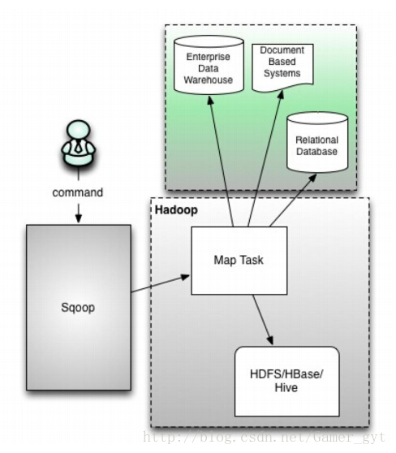
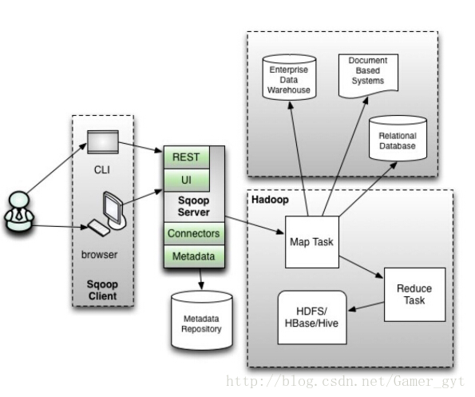

# Sqoop 学习笔记

<!-- TOC -->

- [Sqoop 学习笔记](#sqoop-%e5%ad%a6%e4%b9%a0%e7%ac%94%e8%ae%b0)
  - [介绍](#%e4%bb%8b%e7%bb%8d)
  - [工作原理](#%e5%b7%a5%e4%bd%9c%e5%8e%9f%e7%90%86)
  - [版本选择](#%e7%89%88%e6%9c%ac%e9%80%89%e6%8b%a9)
    - [sqoop1架构](#sqoop1%e6%9e%b6%e6%9e%84)
    - [sqoop2架构](#sqoop2%e6%9e%b6%e6%9e%84)
  - [安装](#%e5%ae%89%e8%a3%85)
    - [源码安装](#%e6%ba%90%e7%a0%81%e5%ae%89%e8%a3%85)
    - [docker 方式安装](#docker-%e6%96%b9%e5%bc%8f%e5%ae%89%e8%a3%85)

<!-- /TOC -->
## 介绍

**`Sqoop 是一个常用的数据迁移工具`**

主要用于在不同存储系统之间实现数据的导入与导出

1.导入数据

> 从 MySQL，Oracle 等关系型数据库中导入数据到 HDFS、Hive、HBase 等分布式文件存储系统中

2.导出数据
> 从 分布式文件系统中导出数据到关系数据库中

**sqoop就是一个工具， 只需要在一个节点上进行安装即可**

[sqoop官网地址](https://sqoop.apache.org/)


## 工作原理

将执行命令转化成 MapReduce 作业来实现数据的迁移，如下图：


## 版本选择

版本选择：

> 目前 Sqoop 有 Sqoop 1 和 Sqoop 2 两个版本

Sqoop进行数据转移时必须依赖于Hadoop的MapReduce作业，所以Hadoop必须在环境中存在，且能被Sqoop访问。

下载时直接选择已编译好的bin版本，直接用。

也可以下源代码到本地编译安装，确保有Java环境，因为Sqoop用Java编写的


### sqoop1架构




### sqoop2架构


很明显，sqoop2中引入了sqoop server集中化管理connector，以及rest api，web，CLI多种交互方式，并引入权限安全机制，较sqoop1有较大改变


## 安装

可以从[这里](https://mirrors.tuna.tsinghua.edu.cn/apache/sqoop/)下载源码包进行安装，也可以使用docker 方式安装

### 源码安装

**`这里安装1.4.7版本，环境Fedora 29 x64`**

1.解压
```
[jian@laptop tools]$ tar xf sqoop-1.4.7.bin__hadoop-2.6.0.tar.gz -C ../
[jian@laptop bigdata]$ mv sqoop-1.4.7.bin__hadoop-2.6.0 sqoop-1.4.7
```
2.修改配置文件
```
[jian@laptop bigdata]$ cd sqoop-1.4.7
[jian@laptop conf]$ cp sqoop-env-template.sh sqoop-env.sh
[jian@laptop conf]$ cat sqoop-env.sh

// 在最后添加下面内容，这里是HADOOP_COMMON_HOME，HADOOP_MAPRED_HOME替换成本地Hadoop目录， hadoop配置会在后面的hadoop学习笔记会涉及到
//这里要先看下hadoop笔记
export HADOOP_COMMON_HOME=/home/jian/prj/bigdata/hadoop-2.10.0
export HADOOP_MAPRED_HOME=/home/jian/prj/bigdata/hadoop-2.10.0
```

3.拷贝mysql驱动

驱动可以去[官网下载](https://dev.mysql.com/downloads/connector/j/)

下载好后放到sqoop目录里面的lib目录中
```
[jian@laptop lib]$ pwd
/home/jian/prj/bigdata/sqoop-1.4.7/lib

[jian@laptop lib]$ ll |grep mysql
-rw-rw-r-- 1 jian jian 2330539 Nov 29 16:57 mysql-connector-java-8.0.18.jar
```

4.修改环境变量
```
[jian@laptop bin]$ cat ~/.bashrc
// 在最后添加下面内容
export SQOOP_HOME=/home/jian/prj/bigdata/sqoop-1.4.7
export PATH=$SQOOP_HOME/bin:$PATH

//执行这个命令，使配置文件生效
[jian@laptop bin]$ source  ~/.bashrc
```

5.测试：
```
// 这里的test是 数据库名，可以根据自己环境进行设置
// xxx 是数据库root密码
[jian@laptop bin]$ sqoop list-databases --connect jdbc:mysql://localhost:3306/test --username root --password xxx

....
information_schema
test
mysql
performance_schema
```


准备测试数据：
demo.sql
```
CREATE TABLE `people` (
`id` varchar(40) COLLATE utf8_bin NOT NULL,
`name` varchar(40) COLLATE utf8_bin NOT NULL,
`age` int(11) DEFAULT NULL,
PRIMARY KEY (`id`)
);
INSERT people VALUES(uuid_short(), CONCAT('姓名',ROUND(RAND()*50)), ROUND(RAND()*100));
INSERT people VALUES(uuid_short(), CONCAT('姓名',ROUND(RAND()*50)), ROUND(RAND()*100));
```


数据导入：
```
mysql> create database test default character set utf8mb4 collate utf8mb4_unicode_ci;


mysql> use test;
Database changed

mysql> show tables;
Empty set (0.00 sec)

#导入sql
mysql> source /tmp/demo.sql  //demo.sql的路径
```


6.把MySQL中的表导入hdfs中
```
//前提：一定要启动hdfs和yarn
//开启方法会在hadoop篇介绍

//这里已经开启好了
[jian@laptop sqoop-1.4.7]$ jps
28194 DataNode
14898 ResourceManager
28053 NameNode
15210 NodeManager
32591 Jps
```

```
//-m 表示启动几个map任务来读取数据,
//如果数据库中的表没有主键这个参数是必须设置的而且只能设定为1  否则会提示报错

[jian@laptop bin]$ sqoop import -m 1 --connect jdbc:mysql://localhost:3306/test --username root --password xxx --table people --target-dir /output

19/11/29 17:07:00 INFO mapreduce.Job: Task Id : attempt_1575006677571_0001_m_000000_0, Status : FAILED
Container launch failed for container_1575006677571_0001_01_000002 : org.apache.hadoop.yarn.exceptions.InvalidAuxServiceException: The auxService:mapreduce_shuffle does not exist
at sun.reflect.NativeConstructorAccessorImpl.newInstance0(Native Method)
at sun.reflect.NativeConstructorAccessorImpl.newInstance(NativeConstructorAccessorImpl.java:62)
at sun.reflect.DelegatingConstructorAccessorImpl.newInstance(DelegatingConstructorAccessorImpl.java:45)
at java.lang.reflect.Constructor.newInstance(Constructor.java:423)
at org.apache.hadoop.yarn.api.records.impl.pb.SerializedExceptionPBImpl.instantiateExceptionImpl(SerializedExceptionPBImpl.java:171)
at org.apache.hadoop.yarn.api.records.impl.pb.SerializedExceptionPBImpl.instantiateException(SerializedExceptionPBImpl.java:182)
at org.apache.hadoop.yarn.api.records.impl.pb.SerializedExceptionPBImpl.deSerialize(SerializedExceptionPBImpl.java:106)
at org.apache.hadoop.mapreduce.v2.app.launcher.ContainerLauncherImpl$Container.launch(ContainerLauncherImpl.java:162)
at org.apache.hadoop.mapreduce.v2.app.launcher.ContainerLauncherImpl$EventProcessor.run(ContainerLauncherImpl.java:393)
at java.util.concurrent.ThreadPoolExecutor.runWorker(ThreadPoolExecutor.java:1149)
at java.util.concurrent.ThreadPoolExecutor$Worker.run(ThreadPoolExecutor.java:624)
at java.lang.Thread.run(Thread.java:748)
```

解决：
```
[jian@laptop hadoop-2.10.0]$ cat etc/hadoop/yarn-site.xml
<!-- Reducer 获取数据的方式-->
<property>
<name>yarn.nodemanager.aux-services</name>
<value>mapreduce_shuffle</value>
</property>
```

增加上面内容，然后**`重启yarn服务`**

再次执行:
```
[jian@laptop bin]$ sqoop import -m 1 --connect jdbc:mysql://localhost:3306/test --username root --password xxx --table people --target-dir /output

...
19/11/29 17:21:13 INFO mapreduce.Job: map 0% reduce 0%
19/11/29 17:21:17 INFO mapreduce.Job: map 100% reduce 0%
19/11/29 17:21:17 INFO mapreduce.Job: Job job_1575019080087_0001 completed successfully
```

7.把hdfs中数据 导入MySQL

连接到mysql进行执行下面的操作：

```
复制表结构：create table people1 select * from people where 1=2;
此处1=2  表示复制表结构，但是不复制主键信息， 不复制表数据
如果写成1=1 表示复制表结构跟表数据
```

然后到sqoop里面执行：
```
[jian@laptop bin]$ sqoop export --connect jdbc:mysql://localhost:3306/test --username root --password xxx --table people1 --export-dir '/output/part-m-00000' --fields-terminated-by ','

```


### docker 方式安装

* 内容待补充