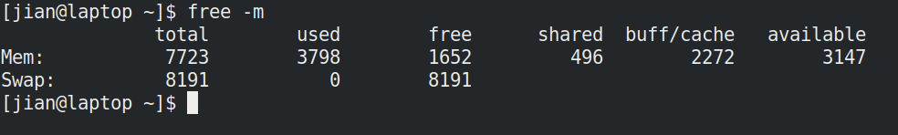
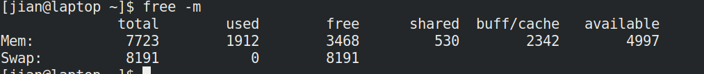
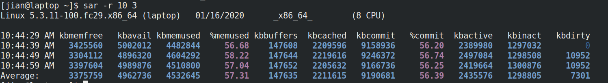

# 内存管理
<!-- TOC -->

- [内存管理](#内存管理)
    - [隔离](#隔离)
    - [独享内存空间](#独享内存空间)
    - [内存管理](#内存管理-1)
    - [常用内存检测命令](#常用内存检测命令)
        - [ps命令](#ps命令)
        - [free命令](#free命令)
        - [pmap命令](#pmap命令)
        - [/proc/meminfo](#procmeminfo)
        - [sar 命令](#sar-命令)

<!-- /TOC -->

## 隔离
* 内容待补充

## 独享内存空间

* 内容待补充

## 内存管理
* 内容待补充

## 常用内存检测命令

### ps命令

单个进程内存使用情况，看下面的例子

1.查看chrome进程ID:
```
[jian@laptop ~]$ ps ux |grep chrome |head -n1
jian      9462  5.2  3.4 1704804 271476 tty2   SLl+ 08:43   3:48 /opt/google/chrome/chrome
```

2.根据进程ID获取该进程的内存占用情况
```
[jian@laptop ~]$ ps -p 9462 -o %cpu,%mem,cmd
%CPU %MEM CMD
 5.1  3.4 /opt/google/chrome/chrome

```
3.按内存占用排序查看进程
```
[jian@laptop ~]$ ps -eo rss,pmem,vsize,args |more
  RSS %MEM    VSZ COMMAND
12120  0.1 381828 /usr/lib/systemd/systemd --switched-root --system --deserialize 18
    0  0.0      0 [kthreadd]
    0  0.0      0 [rcu_gp]
    0  0.0      0 [rcu_par_gp]
    0  0.0      0 [kworker/0:0H-events_highpri]
...
```

### free命令
查看内存大小



返回结果字段意思：
```
total 内存总数
used 已经使用的内存数
free 空闲的内存数
shared 多个进程共享的内存总额
buffers：用来做缓冲的内存
cached：用来做cache的内存
```

从上面结果知道：
```
total 7723MB
userd 3798MB
free 1652MB
shared 496MB
buff/cache 2272MB
available 3147MB
```


注意真正计算linux内存占用的方法是：
```
used – buffers – cached
如上图，内存占用实际为：3798-2272 = 1526M
```

原因是linux下系统缓存的使用会内存优先，当应用程序需要内存时，会自动扔掉缓存给应用程序。


举个例子来说明：

```
[jian@laptop ~]$ mkdir /tmp/test
[jian@laptop ~]$ cp -r /etc/ /tmp/test/ -r 
```

再来看看内存使用情况：



### pmap命令

1.查看chrome进程
```
[jian@laptop ~]$ ps ux |grep chrome |head -n1
jian      9462  3.9  3.3 1367708 264132 tty2   SLl+ 08:43   4:30 /opt/google/chrome/chrome
```
2.获取该进程的内存使用情况
```
[jian@laptop ~]$ pmap 9462
9462:   /opt/google/chrome/chrome    
000025f4e34e1000      4K -----   [ anon ]
000025f4e34e2000    124K rw---   [ anon ]
...
 total          1367712K

```

### /proc/meminfo

也可以查看/proc/meminfo:
```
[jian@laptop ~]$ cat /proc/meminfo
MemTotal:        7908404 kB
MemFree:         1623536 kB
MemAvailable:    3149524 kB
Buffers:          136304 kB
Cached:          2126372 kB
...
```

### sar 命令

每10秒采样一次，连续采样3次，监控内存分页



输出项说明：
```
kbmemfree：这个值和free命令中的free值基本一致,所以它不包括buffer和cache的空间.

kbmemused：这个值和free命令中的used值基本一致,所以它包括buffer和cache的空间.

%memused：这个值是kbmemused和内存总量(不包括swap)的一个百分比.

kbbuffers和kbcached：这两个值就是free命令中的buffer和cache.

kbcommit：保证当前系统所需要的内存,即为了确保不溢出而需要的内存(RAM+swap).

%commit：这个值是kbcommit与内存总量(包括swap)的一个百分比.
```